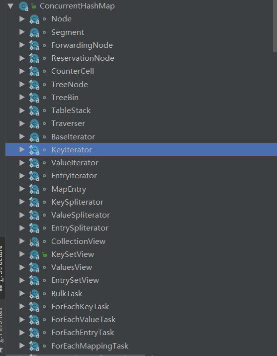

# Concurrenthashmap

​	ConcurrenthashMap 相对于hashMap来说是线程安全的，其底层的hash结构同hashMap一样都是由数组加上链表以及红黑树组成的。引入红黑树是为了提高查找效率，当链表长度大于8时，链表就会转变成红黑树。

## 源码阅读

```java
public class ConcurrentHashMap<K,V> extends AbstractMap<K,V>
    implements ConcurrentMap<K,V>, Serializable
```

ConcurrentHashMap 继承了AbstractMap抽象类，该抽象类定义了Map的put，get等操作。同时实现了ContainKey，ContainValue等操作。同时实现了ConcurrentMap接口，以及Serializable说明ConcurrentHashMap是可以序列化的。

### 内部类

通过观察Concurrenthashmap可以看到他有很多内部类。


​	其中Node类用于存储map的键值等信息，ForwardingNode，ResrvationNodeTreeNode等是他的子类，用于表示不同类型的Node。

 Traverser类用于对map的遍历操作，其子类 BaseIterator，KeyIterator，ValueIterator等都是对map不同类型值的遍历。

CollectionView，视图类，其子类包括键党的视图，值的视图以及hash视图等。

### 属性及默认值

```java
public class ConcurrentHashMap<K,V> extends AbstractMap<K,V>
    implements ConcurrentMap<K,V>, Serializable {
    private static final long serialVersionUID = 7249069246763182397L;
    // 表的最大容量
    private static final int MAXIMUM_CAPACITY = 1 << 30;
    // 默认表的大小
    private static final int DEFAULT_CAPACITY = 16;
    // 最大数组大小
    static final int MAX_ARRAY_SIZE = Integer.MAX_VALUE - 8;
    // 默认并发数
    private static final int DEFAULT_CONCURRENCY_LEVEL = 16;
    // 装载因子
    private static final float LOAD_FACTOR = 0.75f;
    // 转化为红黑树的阈值
    static final int TREEIFY_THRESHOLD = 8;
    // 由红黑树转化为链表的阈值
    static final int UNTREEIFY_THRESHOLD = 6;
    // 转化为红黑树的表的最小容量
    static final int MIN_TREEIFY_CAPACITY = 64;
    // 每次进行转移的最小值
    private static final int MIN_TRANSFER_STRIDE = 16;
    // 生成sizeCtl所使用的bit位数
    private static int RESIZE_STAMP_BITS = 16;
    // 进行扩容所允许的最大线程数
    private static final int MAX_RESIZERS = (1 << (32 - RESIZE_STAMP_BITS)) - 1;
```

### 构造函数

除了无参构造函数外，默认构造函数创建的是 初始容量16，装在因子7.5，以及默认并发数为16的map

还包括以下几个：

`	public ConcurrentHashMap(int initialCapacity)`  #手都指定初始容量

`	public ConcurrentHashMap(Map<? extends K, ? extends V> m) #使用map映射成一个新的map`

`	public ConcurrentHashMap(int initialCapacity, float loadFactor)#指定初始容量和装在因子`

`	

```java
public ConcurrentHashMap(int initialCapacity,
                         float loadFactor, int concurrencyLevel) #指定三个值`
```

### 核心方法

```java
    final V putVal(K key, V value, boolean onlyIfAbsent) {
        if (key == null || value == null) throw new NullPointerException();
        int hash = spread(key.hashCode());
        int binCount = 0;
        for (Node<K,V>[] tab = table;;) {
            Node<K,V> f; int n, i, fh;
            if (tab == null || (n = tab.length) == 0)
                tab = initTable();
            else if ((f = tabAt(tab, i = (n - 1) & hash)) == null) {
                if (casTabAt(tab, i, null,
                             new Node<K,V>(hash, key, value, null)))
                    break;                   // no lock when adding to empty bin
            }
            else if ((fh = f.hash) == MOVED)
                tab = helpTransfer(tab, f);
            else {
                V oldVal = null;
                synchronized (f) {
                    if (tabAt(tab, i) == f) {
                        if (fh >= 0) {
                            binCount = 1;
                            for (Node<K,V> e = f;; ++binCount) {
                                K ek;
                                if (e.hash == hash &&
                                    ((ek = e.key) == key ||
                                     (ek != null && key.equals(ek)))) {
                                    oldVal = e.val;
                                    if (!onlyIfAbsent)
                                        e.val = value;
                                    break;
                                }
                                Node<K,V> pred = e;
                                if ((e = e.next) == null) {
                                    pred.next = new Node<K,V>(hash, key,
                                                              value, null);
                                    break;
                                }
                            }
                        }
                        else if (f instanceof TreeBin) {
                            Node<K,V> p;
                            binCount = 2;
                            if ((p = ((TreeBin<K,V>)f).putTreeVal(hash, key,
                                                           value)) != null) {
                                oldVal = p.val;
                                if (!onlyIfAbsent)
                                    p.val = value;
                            }
                        }
                    }
                }
                if (binCount != 0) {
                    if (binCount >= TREEIFY_THRESHOLD)
                        treeifyBin(tab, i);
                    if (oldVal != null)
                        return oldVal;
                    break;
                }
            }
        }
        addCount(1L, binCount);
        return null;
    }
```

我们用的put函数使用的就是putVal方法，通过阅读我们可以看到他的流程大概是这样的：

1. 判断值或者 键是否为空，若是抛出异常否则进行第二步
2. 判断当前Node数组是否为空，若为空初始化一个Node数组
3. 通过hash值找到Node数组对应的头节点，若发现为空则插入（空节点插入不需要上锁）
4. 若发现hash值为MOVED(-1)则执行helpTransfer方法，该方法是线程安全的，将数据转移到另外一个table的方法，用于扩容等操作。
5. 对表的第一个节点加锁遍历该节点之后的节点，判断key是否相等，若找不到相等的key则新增一个节点插入到最后，若找到key相等的节点就更新值。若节点类型为TreeNode即该分支为红黑树，则按红黑树规则插入。
6. 最后判断插入后的数量若到达红黑树阈值（默认8）则将节点改为红黑树。

```java
    public V get(Object key) {
        Node<K,V>[] tab; Node<K,V> e, p; int n, eh; K ek;
        int h = spread(key.hashCode());
        if ((tab = table) != null && (n = tab.length) > 0 &&
            (e = tabAt(tab, (n - 1) & h)) != null) {
            if ((eh = e.hash) == h) {
                if ((ek = e.key) == key || (ek != null && key.equals(ek)))
                    return e.val;
            }
            else if (eh < 0)
                return (p = e.find(h, key)) != null ? p.val : null;
            while ((e = e.next) != null) {
                if (e.hash == h &&
                    ((ek = e.key) == key || (ek != null && key.equals(ek))))
                    return e.val;
            }
        }
        return null;
    }
```

通过key的hash查看node表中第一个节点是否等于key 若等于返回，否则向后遍历，直到碰到key时返回。

对比HashTable的put方法

```java
    public synchronized V put(K key, V value) {
        // Make sure the value is not null
        if (value == null) {
            throw new NullPointerException();
        }

        // Makes sure the key is not already in the hashtable.
        Entry<?,?> tab[] = table;
        int hash = key.hashCode();
        int index = (hash & 0x7FFFFFFF) % tab.length;
        @SuppressWarnings("unchecked")
        Entry<K,V> entry = (Entry<K,V>)tab[index];
        for(; entry != null ; entry = entry.next) {
            if ((entry.hash == hash) && entry.key.equals(key)) {
                V old = entry.value;
                entry.value = value;
                return old;
            }
        }

        addEntry(hash, key, value, index);
        return null;
    }
```

hashtable的put方法是通过synchronized来实现的，意味着当线程调用hashtable方法时，整个对象都会被锁住。相比较concurentHashmap只锁定头节点理论上性能会差很多，我们可以做一个测试。

```java
package leetcode;

import sun.font.FontRunIterator;

import java.util.Hashtable;
import java.util.Map;
import java.util.concurrent.ConcurrentHashMap;
import java.util.concurrent.CountDownLatch;

/**
 * @Classname HashMapTest
 * @Description TODO
 * @Date 2020/8/14 15:22
 * @Created by rou
 */
public class HashMapTest {
    static final int NUM = 5000;
    static final int TNUM= 100;

    public static void main(String[] args) throws Exception{
        Map<String, Integer> concurrentHashMap = new ConcurrentHashMap<>();
        Map<String, Integer> hashtable = new Hashtable<>();
        Long timec = 0L;
        Long timeh = 0L;
        for (int i = 0; i <= 100; i++) {
            timec+=put(concurrentHashMap);
            timeh+=put(hashtable);
        }
        System.out.println("concurrentHashMap 插入性能："+timec+" ms");
        System.out.println("hashTable 插入性能："+timeh+" ms");
        timec = 0L;
        timeh = 0L;
        for (int i = 0; i <= 100 ; i++) {
            timec+=put(concurrentHashMap);
            timeh+=put(hashtable);
        }
        System.out.println("concurrentHashMap 读取性能："+timec+" ms");
        System.out.println("hashTable 读取性能："+timeh+" ms");

    }
    static long put( Map<String, Integer> map)throws Exception{
        long start = System.currentTimeMillis();
        CountDownLatch countDownLatch = new CountDownLatch(TNUM);
        for (int i = 0; i < TNUM; i++) {
            new putThread(map,countDownLatch).start();
        }
        countDownLatch.await();
        return System.currentTimeMillis()-start;

    }

    static long get(Map<String, Integer> map)throws Exception{
        long start = System.currentTimeMillis();
        CountDownLatch countDownLatch = new CountDownLatch(TNUM);
        for (int i = 0; i < TNUM; i++) {
            new getThread(map,countDownLatch).start();
        }
        countDownLatch.await();
        return System.currentTimeMillis()-start;

    }

}
class putThread extends Thread{
    private Map<String, Integer> map;
    private CountDownLatch countDownLatch;
    private String key = this.getId() + "";
    putThread(Map<String, Integer> map, CountDownLatch countDownLatch) {
        this.map = map;
        this.countDownLatch = countDownLatch;
    }
    @Override
    public void run() {
        for (int i = 1; i <= HashMapTest.NUM; i++) {
            map.put(key, i);
        }
        countDownLatch.countDown();
    }
}
class getThread extends Thread{
    private Map<String, Integer> map;
    private CountDownLatch countDownLatch;
    private String key = this.getId() + "";
    getThread(Map<String, Integer> map, CountDownLatch countDownLatch){
        this.map = map;
        this.countDownLatch = countDownLatch;
    }

    @Override
    public void run() {
        for (int i = 1; i <= HashMapTest.NUM; i++) {
            map.get(key);
        }
        countDownLatch.countDown();
    }
}

```

该代码模拟100个线程对两个map put 和get 各5000次最后对比所用的时间，结果如下：

```
concurrentHashMap 插入性能：1144 ms
hashTable 插入性能：2814 ms
concurrentHashMap 读取性能：897 ms
hashTable 读取性能：2394 ms
```

可以看到concurrentHashMap无论是在读取还是插入方面性能都是远远优于hashTable的。