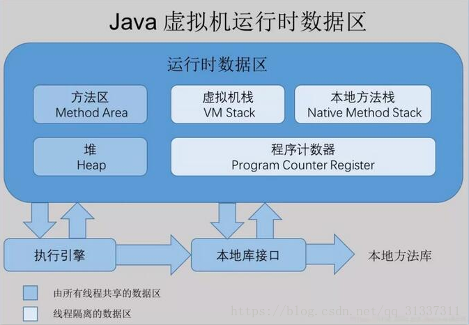

# JAVA 内存区域

# 程序计数器

程序计数器是一块较小的内存空间，它可以看作是当前线程所执行的字节码的行号指示器。字节码解释器工作时就是通过改变这个计数器的值来选取下一条需要执行的字节码，可以通过它来完成，分支、循环、跳转、异常处理线程回复等操作。

由于java每条线程，相对于cpu的一个核来说都是独立的，意味着一个核同一时间只能执行一个线程，所以程序计数器是“线程私有”内存，各线程相互不影响。

如果当前正在执行的是java代码，程序计数器指向的就是该字节码的地址，如果是native的方法则程序计数器为空。值得注意的是该块内存是在java虚拟机中唯一不会发生OOM的内存。

## 虚拟机栈

虚拟机栈也是线程私有的，生命周期与线程相同，当该线程每个方法被执行时，java虚拟机都会同步创建一个栈帧用于存储局部变量表、操作数栈、动态链接、方法出口等信息。每个方法从调用到执行完毕都对对应了一个栈帧在虚拟机栈中的入栈和出栈操作。

### 局部变量表

用于存储编译期可知的基本数据类型，对象引用，和返回值地址。这些数据类型在局部变量表中有slot表示，比如long double占两个slot，变量占多少个slot是一定的，具体每个slot大小由不同的虚拟机自己规定。

### 操作数栈

操作数栈存储的是在执行方法时操作码要操作的数据，原理类似于计算器程序中的操作数栈，当操作码需要操作数据时，从栈中弹出。

### 动态链接

每个栈帧都包含一个指向运行时常量池中该栈帧所属性方法的引用，持有这个引用是为了支持方法调用过程中的动态连接。在Class文件的常量池中存有大量的符号引用，字节码中的方法调用指令就以常量池中指向方法的符号引用为参数。这些符号引用一部分会在类加载阶段或第一次使用的时候转化为直接引用，这种转化称为静态解析。另外一部分将在每一次的运行期期间转化为直接引用，这部分称为动态连接。

### 返回地址

  当一个方法被执行后，有两种方式退出这个方法。第一种方式是执行引擎遇到任意一个方法返回的字节码指令，这时候可能会有返回值传递给上层的方法调用者(调用当前方法的的方法称为调用者)，是否有返回值和返回值的类型将根据遇到何种方法返回指令来决定，这种退出方法方式称为正常完成出口(Normal Method Invocation Completion)。另外一种退出方式是，在方法执行过程中遇到了异常，并且这个异常没有在方法体内得到处理，无论是Java虚拟机内部产生的异常，还是代码中使用athrow字节码指令产生的异常，只要在本方法的异常表中没有搜索到匹配的异常处理器，就会导致方法退出，这种退出方式称为异常完成出口(Abrupt Method Invocation Completion)。一个方法使用异常完成出口的方式退出，是不会给它的调用都产生任何返回值的。   无论采用何种方式退出，在方法退出之前，都需要返回到方法被调用的位置，程序才能继续执行，方法返回时可能需要在栈帧中保存一些信息，用来帮助恢复它的上层方法的执行状态。一般来说，方法正常退出时，调用者程序计数器的值就可以作为返回地址，栈帧中很可能会保存这个计数器值。而方法异常退出时，返回地址是要通过异常处理器来确定的，栈帧中一般不会保存这部分信息。 方法退出的过程实际上等同于把当前栈帧出栈，因此退出时可能执行的操作有：恢复上层方法的局部变量表和操作数栈，把返回值(如果有的话)压入调用都栈帧的操作数栈中，调用PC计数器的值以指向方法调用指令后面的一条指令等。

该区域可能发生两种异常：

1. StachOverflowError，发生于线程请求的栈的深度大于虚拟机所允许的深度。大多发生在各类递归调用期间。
2. OutOfmemoryError，当栈无法申请去到足够的内存时就会发生OOM异常，值得注意的是在hotSpot中虚拟机栈的容量是不可以动态扩展的，所以只有当线程申请栈空间失败时才会OOM。

## 本地方法栈

本地方法栈同虚拟机栈一样，不过时运行native方法时才会产生，hotspot把虚拟机栈和本地方法栈合二为一了。

## JAVA堆

java堆是虚拟机管理的运行时数据区最大的一块区域，是说有线程共享的一块区域，大部分对象实例都在这里分配内存(栈上分配和标量替换等)

java堆是gc管理的内存区域，也可以被称为GC堆，在不同的垃圾收集器中，比如基于分代收集理论设计的还会把它分为年轻代，老年代，永久带等。很多地方会说java堆都是这么分的，其实最近出的很多垃圾收集算法都不是基于分代收集理论的。比如ZGC

java堆可以通过-Xms 和XmX来指定最大最小值，当堆内存不够给新对象分配内存时就会产生OOM，

### 方法区

方法区和堆一样都是各个线程共享的内存区域，用于存储被虚拟机加载的类型信息、常量、静态变量等。在jdk早期版本hotspot虚拟机中方法区并被称为永久代，也能被垃圾回收器回收。但是在jdk8之后方法区被元空间（metaspace）取代，元空间不再是虚拟机内存而是本地内存所以jdk8之后permSize和maxPermGen等参数都失效了，改为调整元空间的参数，元空间最大值默认是无限的，只要本地内存还没满。