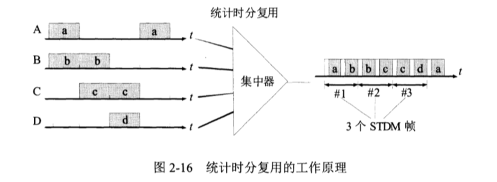

# 物理层

物理层的主要作用是连接各种不同的传输媒体上传输比特流，我们知道随着计算机网络的发展，现在计算机网络中的硬件设备和传输媒体的种类是非常繁多的，我们最常见的传输媒体就是光纤和双绞线。不同的传输媒介对应着不同的传输手段。物理层最重要的作用就是屏蔽掉不同传输手段的差异，使得链路层感觉不到，或者无需关心不同传输媒介，不同传输手段带来的不同。

## 数据通信的基础知识

​	为了更好的理解物理层我们需要了解一些数据通信的有关知识

### 数据通信的基本模型

通讯系统一般包含两个子系统：

**源系统**

原系统内包含两个部分

1. **源点** 源点设备产生的要传输的数据，比如键盘输入的字符，计算机产生的数字比特流等，又被称为**源站**，**信源**
2. **发送器** 数据要经过编码才能在系统中传输，编码设备就是发送器，典型的就是调制器。

**目的系统**：

目的系统也包含两个部分

1. **接收器** 接收器相对于发送器而言，就是将接收到的信号转换成能被处理的信息，典型的就是解调器。
2. **终点** 数据传输的终点，也被称为**目的站**，**信宿**

除此之外还有一些常用术语：

1. **消息**：语音，文字图像等。

2. **数据**：运输消息的实体，让消息能被计算机处理或者理解，如字符串不同编码对应不同的字节流，图像的像素矩阵等。

3. **信号**：信号则是数据的电器或者电磁表现，一般分为两大类：

   (1) **模拟信号** 指的是消息的参数是连续的，比如调制器和解调器在电话两端传输的就是模拟信号。

   (2)**数字信号** 数字信号传递的消息是离散的，不同的波形代表不同的信息，常见的是在使用二进制编码时有两种不同的**码元** 0，和 1；

### 信道

数据传输的路径就是**信道**(channel)根据双方交互方式不同分为三种:

1. **单向信道 ** 即**单工通信** 指消息传递方向是单向的，比如有线广播，或者电视广播等。
2. **双向交替信道** 即**半双工通信** 半双工指的是消息可以双向传输，但是不能同时存在信道中，一般是一方发送另一方接受后再发送。比如某些对讲机有个开关控制发送还是接受。
3. **双向同时通信** 即**全双工通信** 双方同时都能像对方发送消息比如电话。

### 传输媒体

传输媒体就是传输介质或传输媒介，分为两种，即引导型传输媒体和非引导型传输媒体，简单来说就是有线和无线，比如双绞线，光纤就是引导型，通过电磁波传播的就是非引导型。

#### 引导型

1. **双绞线** 就是将相互绝缘的铜导线并排在一起，然后用规则的方法绞合在一起，比如常用的电话线和网线。

   后来根据不同的线缆数量，线材又分为三类，四类，五类， 超五类等，带宽随着类别提高而上升具体如下：

   

2. **同轴电缆**由内导体绝缘层，外导体屏蔽层等组成，目前多用于居民小区的有线电视网

3. **光缆** 通过光导纤维传递脉冲来进行通信，有光脉冲为1，没有为0由于光的频率非常高(约10^8 MHz)因此光纤的带宽远大于其他传输介质。除此之外他还有传输损耗小，抗电磁干扰能力强，密封性好，体积小，重量轻等有点。

#### 非引导型

主要传输媒介就是电磁波分为两种:

1. **地面微波接力**
2. **卫星通信**

### 信道复用技术

简单来说就是对于通信双方不可能单独建立一个信道，当通信方比较多时更经济的方式就是复用信道，当然复用信道需要信道带宽较大，还要加上复用器和分用器，因此只有当通信方较多时才比较经济。

信道复用技术大多使用下面四种:

1. **时分复用** 时分复用就是将时间划分成相等大小的时分复用帧(TDM帧)每一个用户在一个TDM帧中占用一个固定的时隙。

对于传统的时分复用我们可以看到当某个用户停止发送信息而其他用户在连续发送信息时，这个不发送消息的用户占的时隙就浪费了。为此还有STDM时分复用是一种改进的时分复用，远离大概就是收集多个低俗用户的请求，通过集中器缓存这些请求占满STDM帧之后发出。

2. **频分复用** 频分复用就是所有用户在相同的时间里只是用固定的频带。

3. **波分复用 **实际上就是光的频分复用，由于光的频率很高，所以常用波长来承载复用的概念，现在一根光纤已经可以承载几十路甚至更多的复用所以又有了密集波分复用(DWDM)
4. **码分复用 **码分复用也成为码分多址，多个用户可以占有同个频率，同一时间进行通信，但是不同用户使用不同的码型从而让各个用户不互相干扰。

