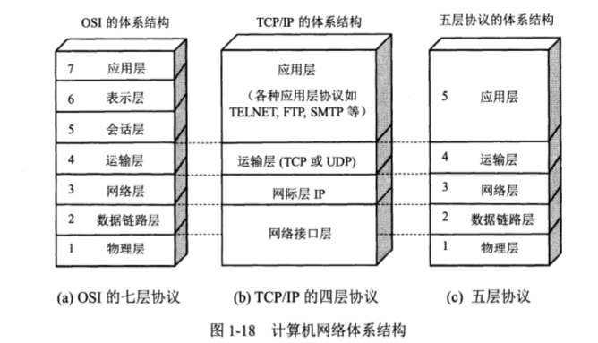
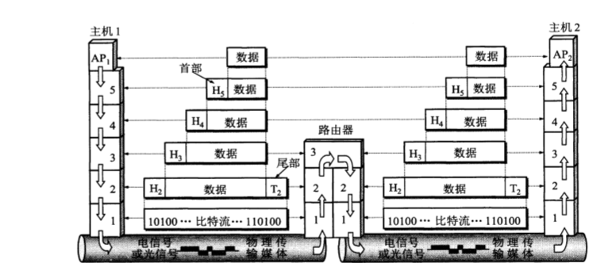
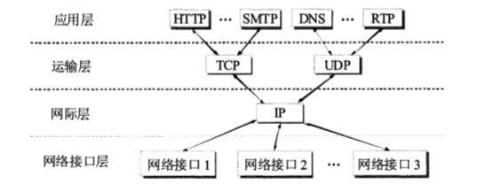

# 绪论

## 计算机网络的分类

#### 按照范围分类

1. **广域网**   **广域网**（英语：Wide Area Network，缩写为 WAN），又称**广域网**、**外网**、**公网**。是连接不同地区[局域网](https://baike.baidu.com/item/局域网)或[城域网](https://baike.baidu.com/item/城域网)计算机通信的远程网。通常跨接很大的物理范围，所覆盖的范围从几十公里到几千公里，它能连接多个地区、城市和国家，或横跨几个洲并能提供远距离通信，形成国际性的远程网络。
2. **城域网**  城域网(Metropolitan Area Network)是在一个[城市](https://baike.baidu.com/item/城市/33549)范围内所建立的[计算机通信网](https://baike.baidu.com/item/计算机通信网/7642504)，简称MAN。属宽带[局域网](https://baike.baidu.com/item/局域网/98626)。由于采用具有有源交换元件的[局域网技术](https://baike.baidu.com/item/局域网技术/2597024)，网中[传输时延](https://baike.baidu.com/item/传输时延/9032205)较小，它的传输[媒介](https://baike.baidu.com/item/媒介)主要采用[光缆](https://baike.baidu.com/item/光缆/6931001)，传输[速率](https://baike.baidu.com/item/速率)在100[兆比特](https://baike.baidu.com/item/兆比特)/秒以上。
3. **局域网** 局域网的覆盖范围一般是方圆几千米之内，其具备的安装便捷、成本节约、扩展方便等特点使其在各类办公室内运用广泛。局域网可以实现文件管理、[应用软件](https://baike.baidu.com/item/应用软件/216367)共享、[打印机共享](https://baike.baidu.com/item/打印机共享/1979511)等功能，在使用过程当中，通过维护局域网网络安全，能够有效地保护资料安全，保证局域网网络能够正常稳定的运行
4. **个人区域网**  个人局域网（英语：Personal Area Network，缩写为PAN），指个人范围（随身携带或数米之内）的计算设备（如[计算机](https://baike.baidu.com/item/计算机)、[电话](https://baike.baidu.com/item/电话)、[PDA](https://baike.baidu.com/item/PDA)、[数字相机](https://baike.baidu.com/item/数字相机)等）组成的[通信网络](https://baike.baidu.com/item/通信网络)。个人网即可用于这些设备之间互相交换数据，也可以用于连接到高层网络或[互联网](https://baike.baidu.com/item/互联网)。

### 按照使用者分类

1. **公用网**  公用网一般是国家的[邮电](https://baike.baidu.com/item/邮电)部门建造的网络."公用"的意思就是从所有愿意按邮电部门规定交纳费用的人都可以使用。

   也指[网络服务提供商](https://baike.baidu.com/item/网络服务提供商/9638709)建设，供公共用户使用的通信网络。公用网络的[通信线路](https://baike.baidu.com/item/通信线路/1527630)是共享给公共用户使用的。

2. **专用网**  专用网指专用于一些的保密性要求较高的部门的网络，比如企业内部专用网、军队专用网，尤其是涉及国家机密的部门。

## 计算机网络的指标

1. **速率**   是描述[数据传输系统](https://baike.baidu.com/item/数据传输系统)的重要技术指标之一，是指[通信](https://baike.baidu.com/item/通信/300982)线上传输信息的速度，在单位时间内（通常为一秒）传输的比特数 [1] 

2. **带宽**  在数字设备中，带宽指单位时间能通过链路的数据量。通常以[**bps**](https://baike.baidu.com/item/bps)来表示，即每秒可传输之位数。

3. **吞吐量** 吞吐量是指对网络、设备、端口、虚电路或其他设施，单位时间内成功地传送[数据](https://baike.baidu.com/item/数据/5947370)的数量（以[比特](https://baike.baidu.com/item/比特/3431582)、[字节](https://baike.baidu.com/item/字节/1096318)、分组等测量）。

4. **时延** 是指数据从网络或链路的一端传送到另一端所需要的时间，时延由如下部分组成

   * **发送时延**  主机或路由器发送数据桢所需的时间
     $$
     发送时延= \frac{数据帧长度(bit))}{发送速率(bit/s))} 
     $$

   * **传播时延** 是电磁波在信道中传播一定距离需要花费的时间

   $$
   传播时延= \frac{信道长度(m))}{电磁波在信道上的传播速率(m/s))}
   $$

   * **处理时延** 主机或路由器在收到分组时花费处理的时间
   * **排队时延** 在经过网络传输时，要经过多个路由器。分组在进入路由器要先在输入队列中排队处理，输出队列也要等待转发，因此产生了排队时延。

5. **时延带宽积** 将传播时延和带宽相乘就得到了时延带宽积，该指标可以表示这条链路可以容纳多少比特。

6. **往返时间RTT** 指的是从A到B再从B回到A的时间，RTT常用于计算有效数据率。假设A发送100M数据，发送时间为8。38s，RTT为2s则
   $$
   有效数据率= \frac{数据长度}{发送时间+RTT} = \frac{100 * 2^{20} *8}{8.29+2} = 80.7Mbit/s
   $$
   比原来的100M小了不少

7. **利用率** 利用率是指信道有百分之几的时间是被利用的，完全空闲的信道理由率为0，信道利用率并非越大越好，过高的利用率会导致通过路由器等节点时要排队产生排队时延。当信道或网络利用率过高会产生非常大的时延。

   

## 计算机网络体系结构

对于两台计算机之间要形成可靠的通信有非常多的工作要做比如：

1. 要有”激活“操作，即要保证要和通信的计算机之间有可靠的信道。两台计算机之间能正常通信。
2. 要告诉网络如何识别目标计算机
3. 确保对方网络正常，对方的文件管理系统是否做好了接受数据的准备
4. 当格式不兼容时，因该如何转换
5. 当传输出现差错是应该如何纠正和抛弃
6. 等等。。。

对此说明网络要能正常运行，需要计算机之间高度协调，显然这种协调是非常复杂的，所以ARPANET设计了”分层"这个概念。分层可以将复杂的问题转换若干较小的局部问题，易于研究和处理。期间不同的公司基于该思想出现过不同的体系结构，不同公司的产品互通非常困难，这与当时正在扩张的计算机市场产生了矛盾，于是ISO国际标准化组织在1977年提出了著名的OSI/RM（**Open System Interconnection**）模型, 到了20世纪90年代初，整套的OSI标准已经提出来了，但是TCP/IP协议已经在全球互联网大范围运用了，且各大厂商也很少有符合OSI标准的产品，所以目前市场上TCP/IP标准才是主流。

无论是OSI还是TCP/IP 都划分了不同的层次，每层又有大量的网络协议。分层可以带来很多好处如：

1. **各层之间相互独立**，不需要关注上下层是怎么实现的，只需要了解上下层的接口提供服务就好了，这样简化了问题。
2. **灵活性好**，当各层实现需要改变时，只要接口不发生改变不会对整个结构产生影响
3. **结构可分割**，每层都可以用最适合的方式来实现。
4. **能促进标准化工作** 

分层也会有一些缺点，比如各层之间需要包装和解封等，会浪费一定的性能和传播资源，还有各层之间难免会有一些重复实现，这也会占一定的开销。

### 五层结构

五层结构是为了方便理解TCP/IP实际上是四层机构，对比OSI来说TCP/IP还是可以对应上的，OSI标准的表示层和会话层目前还没有网络协议。

### 应用层

应用层的任务是通过应用进程间的交互来完成网络任务的应用。协议有：DNS，HTTP，SMTP，FTP等。应用层的交互数据被称为**报文**(message)

### 运输层

运输层也被称为传输层(transport layer) 为进程间通信完成通用的数据传输服务，主要有两种协议

1. **传输控制协议**（**TCP**） 面向连接的可靠的数据传输服务，其数据传输单位是**报文段**(segment)
2. **用户数据报协议**（**UDP**）无连接的数据传输服务，其数据传输单位是**用户数据报**

### 网络层

网络层负责为分组交换网上的不同主机提供通信服务，网络层报文段或者用户数据报封装成**分组**或者**包**来进行传送，在TCP/IP体系中网络层的使用IP协议。

网络层的另外一个任务是选择合适的路由来到达目标主机。

### 数据链路层

数据链路层负责将网络层的IP数据包组装成**帧**（frame）相邻节点上传送帧，每一帧中除了包括IP数据信息外还有控制信息(同步信息，地址信息，差错控制等)

数据链路层可以识别帧是否差错，选择是否丢弃，将处理好的帧交给网络层。

### 物理层

物理层传输的就是**比特**(bit),物理层要考虑多大电压表示 1 或者 0 以及接收方如何识别 01 还要确定硬件的引脚，信道的物理媒介，和信道复用等问题。

下图为数据在各层之间流通的示意图。以及TCPIP协议流程。

